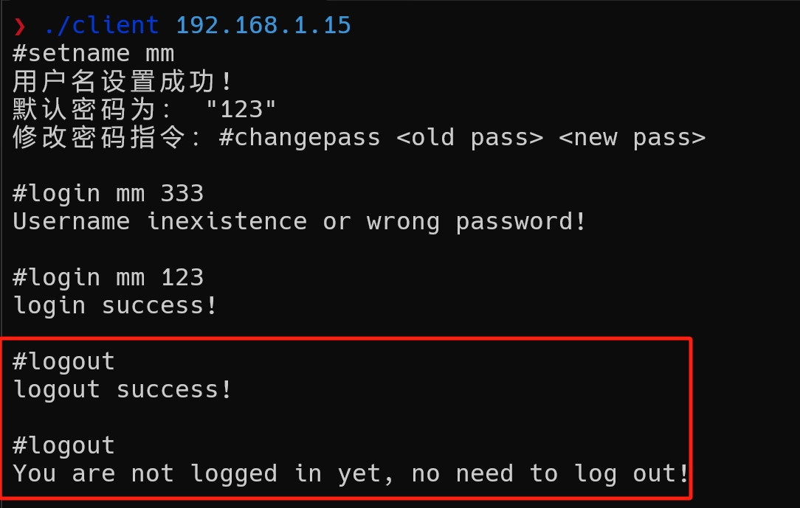

# Linux c tcp聊天室

> 该聊天室是一个命令交互式的，client只需实现读取用户键盘输入，接收服务器发送的数据即可。

## 编译client

~~~c
gcc -o client ./src/client.c
~~~

## 编译server

~~~c
cmake -S . -B build
cd build
make
~~~

会在项目的build目录下生成一个可执行文件：**chat**

## 支持的命令

> 命令是以 # 开头，支持英文

1. setname

   ~~~c
   #setname <user_name>
   ~~~

   

2. login

   ~~~c
   #login <user_name>
   ~~~

   

   

3. logout

   ~~~c
   #logout <user_name>
   ~~~

   

4. private

   ~~~c
   #private <user_name> <string>
   ~~~

   