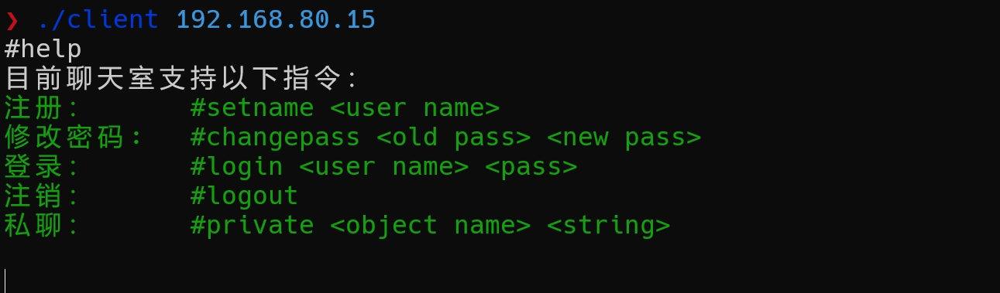

# Linux c tcp聊天室

> 该聊天室是一个命令交互式的，client只需实现读取用户键盘输入，接收服务器发送的数据即可。

## 编译client

~~~c
gcc -o client ./src/client.c
~~~

## 编译server

~~~c
cmake -S . -B build
cd build
make
~~~

会在项目的build目录下生成一个可执行文件：**chat**


## 支持的命令

> 命令是以 # 开头

1. **help**

   ```c
   #help
   ```

   

2. **setname**

   ~~~c
   #setname <user_name>
   ~~~

   

3. **login**

   ~~~c
   #login <user_name> <user_pass>
   ~~~

   

4. **logout**

   ~~~c
   #logout
   ~~~

   

5. **changepass**

   修改密码必须登录后才可以更改

   `````c
   #changepass <old pass> <new pass>
   `````

   

6. **private**

   ~~~c
   #private <user_name> <string>
   ~~~

   